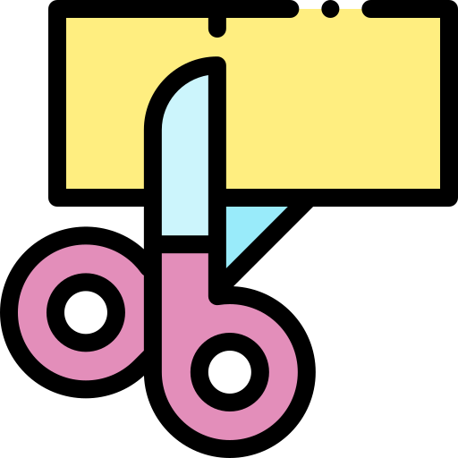
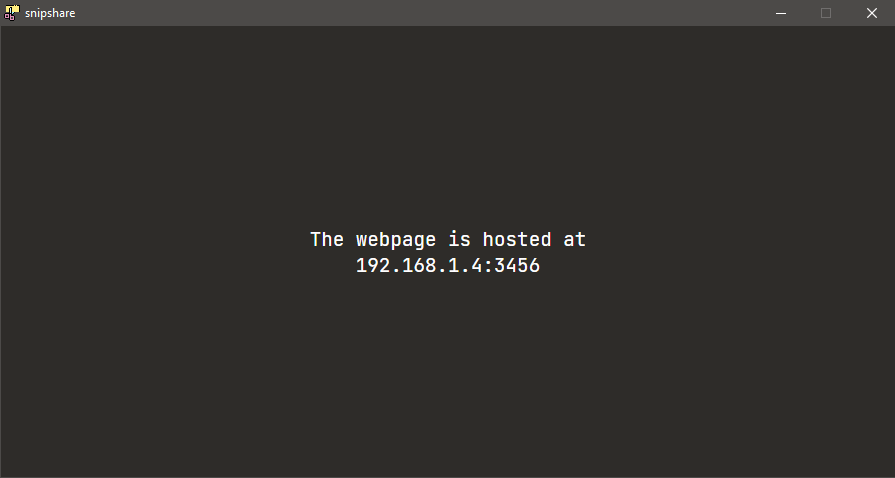
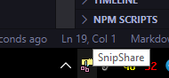
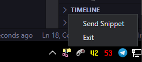

<p align="center">

</p>

# SnipShare
SnipShare is a small tool to quickly share snippets from a desktop environment to mobile so that your handheld device can act as a second monitor for static image content.

This project is for the desktop app + server and is built using ElectronJS for desktop application, ExpressJS/NodeJS for server and Socket.io for sending realtime data.

## Installation
You can download the latest portable win32-64 version of the app from the [Releases](https://github.com/retrogeek46/snipshare/releases) page

## How to Use
- Upon launching the application you will be provided with a url. You can open it using you phone in any recent browser while being connected to the same network as your desktop.
  <p align="center"></p>
- Navigate to the given url on your phone, and then minimize the app. This will close the app to the system tray.
  <p align="center"></p>
- Take a partial/complete screenshot (you can use the shortcut ```Win+L-Shift+S``` to use windows screenshot tool) and then send by right clicking the tray icon and selecting the ```Send Snippet``` option or use the shortcut ```Ctrl+Alt+9``` to directly send the snippet.
  <p align="center"></p>
- The snippet should be visible in your device now.
  <p align="center"></p>

## Attributions
<div><a href="https://www.flaticon.com/free-icon/cut-paper_4225062">Icon</a> made by <a href="https://www.freepik.com" title="Freepik">Freepik</a> from <a href="https://www.flaticon.com/" title="Flaticon">www.flaticon.com</a></div>